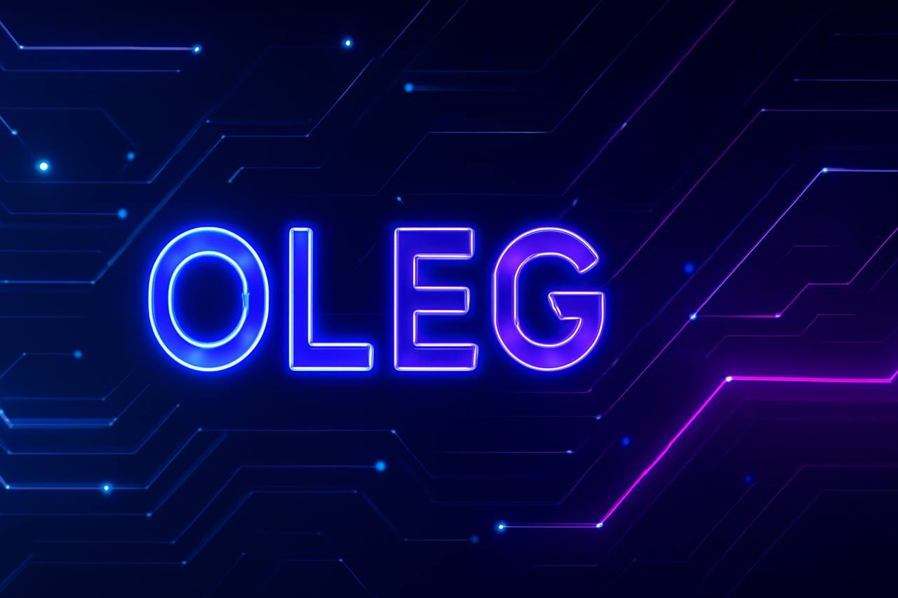

  

    
  

  
  <!-- Banner -->
  <h1 align="center">✨ OLEG — Frontend Developer | Performance-Oriented Engineer ✨</h1>
  

    Angular • TypeScript • Full-Stack Trajectory • Streetlifting Athlete
  

  
  ---
  
  ## 🔥 About Me
  
  Я — Олег, frontend-разработчик с инженерным подходом к продукту.

Моя специализация — производительные, стабильные и масштабируемые интерфейсы.
Я работаю системно: архитектура → производительность → поддерживаемость → бизнес-результат.

Мне важно:
- чтобы проекты загружались быстро
- код был читаемым и расширяемым
- продукт можно было развивать без боли
  
Мой путь строится на дисциплине, спорте, аналитическом мышлении и постоянном росте.
  
  Куда я иду:
  - становлюсь сильным Angular / TS инженером
  - изучаю React → Next.js → Node.js / Nest.js
  - делаю реальные коммерческие проекты
  - строю фундамент для своей студии
  
  ---
  
  ## ⚡ Tech Stack
  
  ### 🎨 Core Stack
  

    
  

  
  ### 🛠 Experience With
  

    
  

  
  ---
  
  ## 💪 Streetlifting / Strength
  
  Силовые тренировки и streetlifting — часть моего образа мышления.  
  Они формируют дисциплину, внимание к деталям и умение работать на длинной дистации.
  
  📌 Current PRs (2025):
  - 🔹 Pull-ups (weighted): 62.5 kg  
  - 🔹 Dips (weighted): 70 kg  
  
  🎯 Goals:
  - ⭐ Pull-ups (weighted): 90 kg  
  - ⭐ Dips (weighted): 140 kg  
  - 🏅 Target: “Master of Sport” (МК)
  
  ---
  
  ## 🧩 Featured Projects
  
  Ниже — ключевые проекты, которые показывают мои навыки:  
  от адаптивной вёрстки до SPA, Angular-приложений и реальных коммерческих сайтов.
  
  ---
  
  ### 🌿 HomeDecor — интернет-магазин растений
      Angular + Node.js + MongoDB | Full SPA

Современный полнофункциональный интернет-магазин растений, реализованный как высокопроизводительное SPA-приложение.
Проект сфокусирован на скорости работы, удобстве пользователя и масштабируемой архитектуре.

  ---

🔧 Реализовано
 • динамический каталог товаров с многоуровневой фильтрацией
 • корзина, избранное и оформление заказов
 • авторизация и личный кабинет пользователя
 • сохранение состояния приложения через query-параметры
 • мгновенная подгрузка данных без перезагрузки страницы

  ---

🔗 Ссылки

👉 Демо:         https://frontend-12sk.onrender.com
👉 Исходный код: https://github.com/Oleg-Frontend-creator/plans-shop
  
  ---
  
  ### 💰 LuminCoin — Finance Manager (JS → TypeScript)  
  Полный SPA для управления доходами и расходами:
  - работа с MongoDB backend  
  - регистрация / авторизация  
  - динамическое обновление контента  
  - роутинг без перезагрузки  
  - полностью переписан в TypeScript
  
  👉 JS: https://github.com/Oleg-Frontend-creator/LuminCoinFinance  
  👉 TypeScript: https://github.com/Oleg-Frontend-creator/LuminCoin
  
  ---
  
  ### 🧠 ITLogia Quiz — Testing Platform (SPA)  
  Приложение для тестирования пользователей:  
  - загрузка тестов с backend  
  - авторизация  
  - SPA-логика  
  - динамическое отображение вопросов  
  
  👉 https://github.com/Oleg-Frontend-creator/Itlogia-quiz
  
  ---
  
  ## 🎨 Adaptive Landing Pages
  
  ### 🍮 Macaroons Store — HTML/CSS → Angular  
  ⭐ Версия на Angular — компонентная, структурная, расширенная.
  
  👉 Demo: https://oleg-frontend-creator.github.io/Macaroons/  
  👉 Angular версия: https://github.com/Oleg-Frontend-creator/macaroons-on-angular
  
  ---
  
  ### 🏜 Cappadocia Tour — Travel Landing  
  👉 Demo: https://oleg-frontend-creator.github.io/Cappadocia-tour/
  
  ---
  
  ### 🍪 Cookies Landing — ITLogia Intensive  
  👉 Demo: https://oleg-frontend-creator.github.io/cookies/
  
  ---
  
  ## 🛫 Commercial Work
  
  ### ✈️ Domodedovo Airport — Recruitment Site  
  Проект для реального заказчика:  
  - многостраничный сайт  
  - адаптив  
  - чистая, аккуратная реализация  
  
  👉 https://dmdpassport.ru/index.html
  
  ---
  
  ## 🧭 Roadmap (My Direction)
  
  - Angular → React → Next.js  
  - Node.js / Express → Nest.js  
  - CI/CD (углубленно), Docker (углубленно), DevOps-основа  
  - Создание собственной мини-студии  
  
  ---
  
  ## 📊 GitHub Stats
  
  

    
    
  

  
  ---
  
  ## 📫 Connect With Me
  
  🌐 Сайт: https://modernstack.ru
  💬 Telegram: @webbuilding_moscow
  📧 Email: olegpravdinsc@gmail.com
  ---
  <h3 align="center">⚡ Code. Build. Grow. Становиться сильнее — в коде, спорте и мышлении. ⚡</h3>
